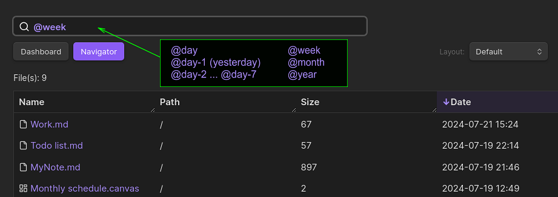

# Dashboard navigator plugin for Obsidian

**Dashboard navigator** was designed to help you manage and quickly navigate your knowledge base. You can get instant overview of key vault stats, categorized recent files, total number of files per category (notes, images, audios, videos and more) and powerful search to easily locate your vault files (navigator).

## Features

- **Vault stats and graph**: Gain insightful statistics about your vault, including:
  - Number of notes, images, audios, videos, PDF and other file formats.
    - When you click on the dashboard file type buttons (desired file type) you will enter the navigator mode with the results only showing the desired file type. 
  - Total files, 
  - Total folders, 
  - Vault pie chart of notes and other file formats.
  
- **Recent files by type**: Easily access your most frequently used files, categorized for quick reference. Save time searching and keep important notes readily available.

- **Advanced file search**: Find your files quickly with powerful **search** and **sort** functionalities. Search and sort files by **name**, **path** (location within your vault), **size** and **date**. You can also search notes by **tag**.
  - You can search using some knowledge of regular expressions, for example you can search for notes with **tags** `#work` or `#pending` typing `#work|#pending`.

## Filter Notes and Files by Day, Week, Month and Year

- Enter `@` + the keywords below to quickly filter the results:
  - `day` (or today)
  - `day-1` (yesterday)
  - `day-2` to `day-7`
  - `week`
  - `month`
  - `year`
 
## Sort Files

- You can sort the files by double clicking on the table header and also by using the dropdown select.
 
## Display Results

- You can select 4 types of layouts to display the search results:
  - Default
  - Row striped
  - Column striped
  - Bordered
 
## Context Menu

- Right-click the mouse button on the desired file link or table result to open the context menu. You can open the note in various ways (same tab, new tab, new window and also show its properties). You can also open the note by **double clicking** on the desired result.

## File Properties

## Excluded File Extensions

- Open **plugin settings** and select the file extensions that you don't want to display (extensions separated by commas).

- Enter file extensions: In the provided text field, list the file extensions you want to exclude, separated by commas. For example: `txt, docx, js`.

## Excluded Folders

- Open **plugin settings** and select the file extensions that you don't want to display (folder paths separated by commas).

- Enter folder paths: In the provided space, list the folder names or paths to the folders(subfolders) you want to exclude, separating them with commas. For example: `folder1/subfolder, source_files, folder2`.

## Colored Files

- Select custom colors for files in the dashboard and navigator views. These colors will be reflected in the piechart graph, making it easier to identify and track different file types. To activate this feature, go to **plugin settings** and **toggle colored files**.

## Plugin Settings

### Select Custom Colors

- Open **plugin settings** and select custom colors for notes, images and other file categories (piechart and files).

## Installation

1. Open **Obsidian Settings**.
2. In the side menu, select **Community plugins**.
3. Select **Browse** (button).
4. Search for **Dashboard navigator**.
5. Select it and choose **Install**.
6. **Enable** Dashboard navigator after installation.

## Manually installing the plugin

- Copy over `main.js`, `styles.css`, `manifest.json` to your vault `VaultFolder/.obsidian/plugins/dashboard-navigator/`.

## Feedback

Have suggestions for new features, usability improvements, or found a bug? Your feedback is appreciated! Submit an issue on GitHub and I'll do my best to respond as soon as possible. Thanks.

## License and Acknowledgements

Dashboard navigator plugin for Obsidian

MIT License ⓒ Bernardo Pires

The Dashboard navigator icon (ribbon icon) and file icons are from [Lucide](https://lucide.dev/) Icons used by Obsidian. The Lucide icon library is licensed under the [ISC License](https://lucide.dev/license).
