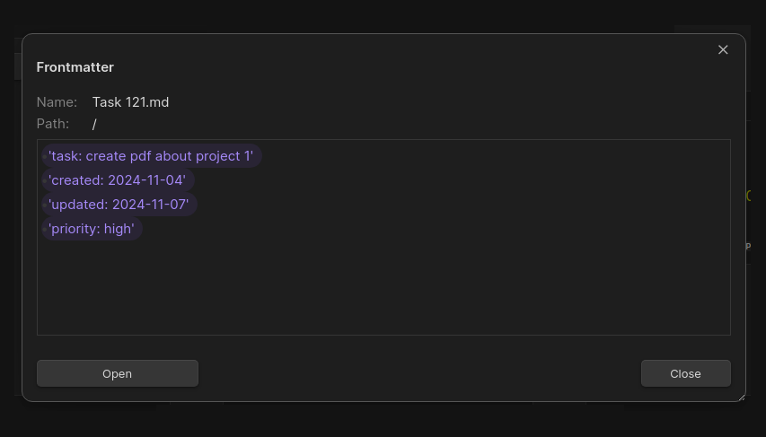

# Dashboard navigator plugin for Obsidian

**Dashboard navigator** was designed to help you manage and quickly navigate your knowledge base. You can get instant overview of key vault stats, categorized recent files, total number of files per category (notes, images, audios, videos and more) and powerful search to easily locate your vault files (navigator).

## Features

- **Vault stats and graph**: Gain insightful statistics about your vault, including:
  - Number of notes, images, audios, videos, PDF and other file formats.
    - When you click on the dashboard file type buttons (desired file type) you will enter the navigator mode with the results only showing the desired file type. 
  - Total files, 
  - Total folders, 
  - Vault pie chart of notes and other file formats.
  
- **Recent files by type**: Easily access your most frequently used files (created/modified), categorized for quick reference. Save time searching and keep important notes readily available.

- **Recently opened files**: Quickly access your recently opened files. To see a file in the list, simply close its tab or open another file.

- **Advanced file search**: Find your files quickly with powerful **search** and **sort** functionalities. More information below.

## Intuitive Advanced Search

The Dashboard navigator search allows you to quickly access and filter specific files within your vault. Quickly find notes, images, canvases, audios, videos, PDFs, and more with simple commands.

### Basic Commands

- `@notes`: Lists all **notes**.
- `@images`: Lists all **images**.
- `@canvas` or `@canvases`: Lists all **canvases**.
- `@audios`: Lists all **audio** files.
- `@videos`: Lists all **video** files.
- `@pdf` or `@pdfs`: Lists all **PDF** files.
- `@other`: Lists all **other** file types.

### Advanced Filtering with Search Terms

You can combine the basic commands with search terms to narrow down your results:

* `@notes #tag1`: Lists **notes** with the tag `#tag1`.
* `@notes desired_word #tag2`: Lists **notes** with `desired_word` and `#tag2`.

### Search Filters Shorthands
- **File categories shorthands**: 
  - `@n` = `@notes`
  - `@i` = `@images`
  - `@c` = `@canvas` or `@canvases`
  - `@a` = `@audios`
  - `@v` = `@videos`
  - `@p` = `@pdf`or `@pdfs`
  - `@o` = `@other`or `@others`

### Date Filters and Shorthands

For quick filtering by date ranges, use the following date filters or the respective shorthands:

* **Current Day:**
  - `@d`, `@day`, or `@today`
* **Current Day and Yesterday:**
  - `@d-1` or `@day-1`
* **Current Day and Past X Days:**
  - `@d-2` to `@d-7` or `@day-2` to `@day-7` (for 2 to 7 days before)
* **Current Week:**
  - `@w` or `@week`
* **Current Month and Past X Months:**
  - `@m` or `@month` (current month)
  - `@m-1` or `@month-1` (current month and previous month)
  - `@m-2` to `@m-12` or `@month-2` to `@month-12` (current month and 2 to 12 months prior)
* **Current Year:**
  - `@y` or `@year`

**Example:**

To filter for data from the current month and the previous month, you would use `@m-1`.

### Combining Search Terms, File Types and Date Filters

You can combine search terms, file types (one per search) and date filters for more precise results:

- `@notes #tag1 @month`: Lists **notes** with the tag `tag1` created/modified this month (*Shorthand*: `@n #tag1 @m`).
- `@images @week`: Lists **images** added this week (*Shorthand*: `@i @w`).

### Quoted Search

  - **Specific Quoted Search**: Search for specific sentences using double quotes or single quotes. For example, `"this is the description of a note"`.

### Additional Tips

* **Case Sensitivity:** Search terms are **case-insensitive**.

* **Multiple Commands:** You can use **multiple commands in a single query**, separated by spaces.

* Feel free to experiment with different combinations of commands and filters to find the best way to access your content. For example: `@month @notes` and `@notes @month` (same effect -> lists notes created/modified in the month). You can even expand this search with `@month @notes title_of_the_note` (or part of the note title, or tag).

### Excluding Results

To exclude specific content from your search results, you can use the `!` exclamation point followed by the text, tag or folder you want to exclude. This will remove any items that match the exclusion term.

**Example:**

- `@notes #work #pending !#urgent`: This will list **all notes** tagged with `#work` and `#pending` except those tagged with `#urgent`.

### Combining Exclusions with Other Filters

You can combine exclusions with other filters, such as tags and date, to further refine your search:

- `@notes #meeting !#international @month`: This will list all notes tagged with `#meeting` that were created or modified this month, **excluding** those tagged with `#international`.

- To find all notes tagged `#meeting` created/modified in the current month: `@notes #meeting @month`.

By effectively using exclusions, you can tailor your searches to your specific needs and quickly find the information you're looking for.

### Frontmatter Metadata Search

To search for specific frontmatter metadata, use the following syntax:

**1. Search by Property or Value:**

- **Property Match (all notes with this property)**: `'name_of_the_property:'`

  - Example: `'task:'` or `'created:'`

- **Search for the value in one metadata property:** `'task:' value` or `'task:' 'This is a sentence to match'`. The sentence to match can be in single or double quotes

  - Example: `'task:' 'create pdf'`

**2. Search by Property and Value:**

- **Exact Match:**
`'name_of_the_property: value'`

  - Example: `'topic: javascript'`

**Tips:**

- Use single quotes (`'`) to enclose when searching for specific metadata.

- You can use the context menu (navigator view or dashboard view to open the **Frontmatter** or **File Properties** modal). Click on the desired frontmatter metadata to quickly search for an exact match within your notes.

## Sort Files

- You can sort the files by double clicking on the table header and also by using the dropdown select.
 
## Display Results

- You can select 4 types of layouts to display the search results:
  - Default
  - Row striped
  - Column striped
  - Bordered

## Preview Files (Hover and Context Menu)

- **Quick File Inspection**: You can choose to preview files using either the **hover preview** or the dedicated context menu item (**Show preview**) in the Dashboard and/or Navigator views. 

- By simply hovering over a file or note while holding down the `Ctrl` (Windows/Linux) or `Command` (macOS) key, you can instantly preview its content.

- **Context Menu**: `Show preview` option. This allows you to preview a file or note without the need for a modifier key.

- The **preview window** displays the file's **name** and **path**. You will find three buttons on this window:

1. **Open**: Directly opens the file.
2. **Open in New Tab**: Opens the file in a new tab.
3. **Open in New Window**: Opens the file in a completely new window.

### Drag-and-Drop Preview Window

- **Drag-and-Drop Positioning**: You have the freedom to move the preview window to any desired location on the screen. The preview window's position is remembered for subsequent previews (till you close the Dashboard navigator window), ensuring consistency and reducing the need for constant readjustment.

- **Default Position**: If you close and reopen the Dashboard navigator window, the preview will automatically return to its default position.
 
## Context Menu

- Right-click the mouse button on the desired file link or table result to open the context menu. You can open the note in various ways (same tab, new tab, new window and also show its properties and metadata). You can also open the note by **double clicking** on the desired result.

## File Properties

## Frontmatter Modal

## Navigator View: Hide Columns

The column-hiding feature gives you the flexibility to customize the **navigator view** to suit your specific preferences and workflow. By **hiding unnecessary columns**, you can create a cleaner, more focused view that highlights the information most relevant to you.

You can hide the following columns:
- **Ext**: Shows the file extension.
- **Path**: Shows the location of the file within your vault structure.
- **Size**: Displays the file size of the file.
- **Date**: Indicates the modification date of the file.
- **Tags**: Lists the tags associated with the note, making it easier to categorize and search for notes.
- **Frontmatter**: Lists the frontmatter/metadata associated with the note.

## Excluded File Extensions

- Open **plugin settings** and select the file extensions that you don't want to display (extensions separated by commas).

- Enter file extensions: In the provided text field, list the file extensions you want to exclude, separated by commas. For example: `txt, docx, js`.

## Excluded Folders

- Open **plugin settings** and select the file extensions that you don't want to display (folder paths separated by commas).

- Enter folder paths: In the provided space, list the folder names or paths to the folders(subfolders) you want to exclude, separating them with commas. For example: `folder1/subfolder, source_files, folder2`.

## Colored Files

- Select custom colors for files in the dashboard and navigator views. 
- These colors will be reflected in the piechart graph, making it easier to identify and track different file types. To activate this feature, go to **plugin settings** and **toggle colored files**.

## Plugin Settings

## Installation

1. Open **Obsidian Settings**.
2. In the side menu, select **Community plugins**.
3. Select **Browse** (button).
4. Search for **Dashboard navigator**.
5. Select it and choose **Install**.
6. **Enable** Dashboard navigator after installation.

## Manually installing the plugin

- Copy over `main.js`, `styles.css`, `manifest.json` to your vault `VaultFolder/.obsidian/plugins/dashboard-navigator/`.

## Feedback

Have suggestions for new features, usability improvements, or found a bug? Your feedback is appreciated! Submit an issue on GitHub and I'll do my best to respond as soon as possible. Thanks.

## License and Acknowledgements

Dashboard navigator plugin for Obsidian

MIT License ⓒ Bernardo Pires

The Dashboard navigator icon (ribbon icon) and file icons are from [Lucide](https://lucide.dev/) Icons used by Obsidian. The Lucide icon library is licensed under the [ISC License](https://lucide.dev/license).
