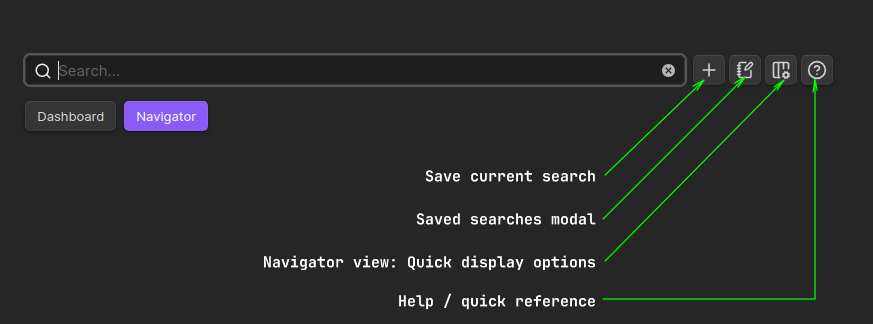

# Dashboard navigator plugin for Obsidian

**Dashboard Navigator** was designed to help you manage and quickly navigate your knowledge base. You can get instant overview of key vault stats, categorized recent files, total number of files per category (notes, images, audios, videos and more) and powerful search to easily locate your vault files (navigator).

## Features

- **Vault stats and graph**: Gain insightful statistics about your vault, including:
  - Number of notes, images, audio files, videos, PDF and other file formats.
    - When you click on the dashboard file type buttons (desired file type) you will enter the navigator mode with the results only showing the desired file type. 
  - Total files, 
  - Total folders, 
  - Vault pie chart of notes and other file formats.
  
- **Recent files by type**: Easily access your recently created or modified files, categorized for quick reference. Save time searching and keep important notes readily available.

- **Recently opened files**: Quickly access your recently opened files. To see a file in the list, simply close its tab or open another file.

- **Bookmarks**: Easily access your bookmarked files. The number you set here is independent of other dashboard sections. The order of these bookmarks will match the order you've set in your bookmarks sidebar. You can view bookmarked files in Navigator view.

- **Advanced file search**: Find your files quickly with powerful **search** and **sort** functionalities. More information below.

## Intuitive Advanced Search

The Dashboard navigator search allows you to quickly access and filter specific files within your vault. Quickly find notes, images, canvases, audios, videos, PDFs, and more with simple commands.

### Basic Commands

- `@notes`: Lists all **notes**.
- `@images`: Lists all **images**.
- `@canvas` or `@canvases`: Lists all **canvases**.
- `@audio` or `@audios`: Lists all **audio** files.
- `@videos`: Lists all **video** files.
- `@pdf` or `@pdfs`: Lists all **PDF** files.
- `@other`: Lists all **other** file types.
- `@bases`: Lists all **.base** files.
- `@bookmarks`: Lists all **bookmarked** files.

### Advanced Filtering with Search Terms

You can combine the basic commands with search terms to narrow down your results:

* `@notes #tag1`: Lists **notes** with the tag `#tag1`.
* `@notes desired_word #tag2`: Lists **notes** with `desired_word` and `#tag2`.

### Search Filters Shorthands
- **File categories shorthands**: 
  - `@n` = `@notes`
  - `@i` = `@images`
  - `@c` = `@canvas` or `@canvases`
  - `@a` = `@audio`
  - `@v` = `@videos`
  - `@p` = `@pdf`or `@pdfs`
  - `@o` = `@other`or `@others`
  - `@bb` = `@bases`
  - `@bm` = `@bookmarks`

### Date Filters and Shorthands

For quick filtering by date ranges, use the following date filters or the respective shorthands:

* **Current Day:**
  - `@d`, `@day`, or `@today`
* **Current Day and Yesterday:**
  - `@d-1` or `@day-1`
* **Current Day and Past X Days:**
  - `@d-2` to `@d-7` or `@day-2` to `@day-7` (for 2 to 7 days before)
* **Current Week:**
  - `@w` or `@week`
* **Current Month and Past X Months:**
  - `@m` or `@month` (current month)
  - `@m-1` or `@month-1` (current month and previous month)
  - `@m-2` to `@m-12` or `@month-2` to `@month-12` (current month and 2 to 12 months prior)
* **Current Year:**
  - `@y` or `@year`

**Example:**

To filter for data from the current month and the previous month, you would use `@m-1`.

### Combining Search Terms, File Types and Date Filters

You can combine search terms, file types (one per search) and date filters for more precise results:

- `@notes #tag1 @month`: Lists **notes** with the tag `tag1` created/modified this month (*Shorthand*: `@n #tag1 @m`).
- `@images @week`: Lists **images** added this week (*Shorthand*: `@i @w`).

### Quoted Search

  - **Specific Quoted Search**: Search for specific sentences in frontmatter metadata or for specific filename using double or single quotes. For example, `"this is the description of a note"`.

### Additional Tips

* **Case Sensitivity:** Search terms are **case-insensitive**.

* **Multiple Commands:** You can use **multiple commands in a single query**, separated by spaces.

* Feel free to experiment with different combinations of commands and filters to find the best way to access your content. For example: `@month @notes` and `@notes @month` (same effect -> lists notes created/modified in the month). You can even expand this search with `@month @notes title_of_the_note` (or part of the note title, or tag).

### Excluding Results

To exclude specific content from your search results, you can use the `!` exclamation point followed by the text, tag or folder you want to exclude. This will remove any items that match the exclusion term.

**Example:**

- `@notes #work #pending !#urgent`: This will list **all notes** tagged with `#work` and `#pending` except those tagged with `#urgent`.

### Combining Exclusions with Other Filters

You can combine exclusions with other filters, such as tags and date, to further refine your search:

- `@notes #meeting !#international @month`: This will list all notes tagged with `#meeting` that were created or modified this month, **excluding** those tagged with `#international`.

- To find all notes tagged `#meeting` created/modified in the current month: `@notes #meeting @month`.

By effectively using exclusions, you can tailor your searches to your specific needs and quickly find the information you're looking for.

### Frontmatter Metadata Search

To search for specific frontmatter metadata, use the following syntax:

**1. Search by Property or Value:**

- **Property Match (all notes with this property)**: `'name_of_the_property:'`

  - Example: `'task:'` or `'created:'`

- **Search for the value in one metadata property:** `'task:' value` or `'task:' 'This is a sentence to match'`. The sentence to match can be in single or double quotes

  - Example: `'task:' 'create pdf'`

**2. Search by Property and Value:**

- **Exact Match:**
`'name_of_the_property: value'`

  - Example: `'topic: javascript'`

**Tips:**

- Use single quotes (`'`) to enclose when searching for specific metadata.

- You can use the context menu (navigator view or dashboard view to open the **Frontmatter** or **File Properties** modal). Click on the desired frontmatter metadata to quickly search for an exact match within your notes.

### Bookmarks

New **@bookmarks** command (Navigator view - search): `@bookmarks` or `@bm` as its shorthand. This command will **list all bookmarked files** in Navigator view, so you can sort them by file name, extension, path, date, search for tags and frontmatter.

- You can search for the file categories using the additional `@bookmarks`or `@bm` filter to identify which ones are bookmarked, e.g. `@notes @bm` (notes that are bookmarked) or `@images @bm`(images in your bookmarks).

### Tag actions

You can quickly filter your search results by interacting with **tags** directly within the **Navigator view**, **File Properties modal**, or **Tags modal**. These actions let you include or exclude tags from your current search query.

  - A `Shift + left-click` on a tag toggles between these states:

    - **Add tag:** This adds the tag to your search query. You'll **only see results that have this tag.** (e.g., `#tag`)

    - **Remove tag:** This removes the tag from your search query. The tag will **no longer filter your results**.

  - A `Ctrl + left-click` on a tag toggles between these states, specifically managing an *exclusion command*:

    - **Add exclusion command:** This adds a command to your search query to **exclude** the tag. You'll **only see results that *do NOT* have this tag.** (e.g., `!#tag`)

    - **Remove exclusion command:** This removes the exclusion command for that tag from your search query. The tag will **no longer filter your results by exclusion**.

#### Quick Search Reset: `Shift + middle-click` any tag
- `Shift + middle-click` any tag to clear the main search field.

## Search Top Buttons

## Save Search

- You can now **save your search queries** directly from the Navigator view! This feature lets you store complex or frequently used searches, along with a helpful **description**, so you can easily find and reuse them later.

## Saved Searches and Filter

- Just click on any saved search within the modal, and it'll instantly run that search in your Navigator view. No more re-typing complex queries! You can also filter your saved searches.
- **Left-click on the selected saved search** in order to search in Navigator view.
- **Double-click** the selected search to run it in Navigator view and close the saved search modal.

## Navigator View: Quick Display Options Modal

A new modal provides quick display options for Navigator view. Changes made here will update plugin settings. You can show/hide columns and toggle image thumbnails directly from this modal.

- **Tip:** **Right-clicking on any table header** will open this modal.

## Sort Files

- You can sort the files by double clicking on the table header and also by using the dropdown select.
 
## Display Results

- You can select 5 types of layouts to display the search results:
  - Default
  - Row striped
  - Column striped
  - Bordered
  - Cards
 
## Navigator View: Cards Layout

A new '**Cards**' layout option is now available in Navigator view. You can select this layout from the **layout dropdown menu** or within the **plugin settings**. This layout is also recommended for mobile devices.

## Image Thumbnails

**Image thumbnails** are now displayed as previews in table and Cards layouts. You can deactivate image previews in settings or through the **Navigator view's quick display options** (it will show image icons when deactivated).

## Preview Files (Hover and Context Menu)

- **Quick File Inspection**: You can choose to preview files using either the **hover preview** or the dedicated context menu item (**Show preview**) in the Dashboard and/or Navigator views. 

- By simply hovering over a file or note while holding down the `Ctrl` (Windows/Linux) or `Command` (macOS) key, you can instantly preview its content.

- **Context Menu**: `Show preview` option. This allows you to preview a file or note without the need for a modifier key.

- The **preview window** displays the file's **name** and **path**. You will find three buttons on this window:

1. **Open**: Directly opens the file.
2. **Open in New Tab**: Opens the file in a new tab.
3. **Open in New Window**: Opens the file in a completely new window.

### Drag-and-Drop Preview Window

- **Drag-and-Drop Positioning**: You have the freedom to move the preview window to any desired location on the screen. The preview window's position is remembered for subsequent previews (till you close the Dashboard navigator window), ensuring consistency and reducing the need for constant readjustment.

- **Default Position**: If you close and reopen the Dashboard navigator window, the preview will automatically return to its default position.
 
## Context Menu

- Right-click the mouse button on the desired file link or table result to open the context menu. You can open the note in various ways (same tab, new tab, new window and also show its properties and metadata). You can also open the note by **double clicking** on the desired result.

## File Properties

## File Frontmatter Modal

## File Tags Modal

## Navigator View: Hide Columns

The column-hiding feature gives you the flexibility to customize the **navigator view** to suit your specific preferences and workflow. By **hiding unnecessary columns**, you can create a cleaner, more focused view that highlights the information most relevant to you.

You can hide the following columns:
- **Ext**: Shows the file extension.
- **Path**: Shows the location of the file within your vault structure.
- **Size**: Displays the file size.
- **Date**: Indicates the modification date of the file.
- **Tags**: Lists the tags associated with the note, making it easier to categorize and search for notes.
- **Frontmatter**: Lists the frontmatter/metadata associated with the note.

## Tags Dashboard View

- **Advanced tag(s) search**: This feature uses secondary tags as cross-references to help you navigate your notes like a dynamic map. By revealing which tags are used together, you can discover hidden associations and see how different ideas and topics are implicitly connected in your vault.

- The tags dashboard's initial state shows a list of your most recently created or modified notes along with their corresponding tags. This gives you a quick overview of your recent activity.

- The `@tags` command (top search bar) to search directly in **Tags** dashboard view:

  - **Beginning of the query**: When you start a search with `@tags`, it acts as a shortcut. It immediately switches your view to the Tags dashboard and focuses the cursor in the Tags dashboard's search bar, allowing you to start a new tag-focused search right away.

  - **End of the query**: When you place `@tags` at the end of a tag(s) search (e.g., `#tag1 #tag2 @tags`), it opens the Tags dashboard and shows you all the secondary tags that are used in conjunction with the tag(s) you've already searched for (primary tag or tags query). This helps you find related topics and discover connections between your notes.

- You can also save the tags search using `@tags` with a description (saved searches window). When clicking on the saved search option it will open the saved query directly in **Tags** dashboard view.

### **Tags Dashboard Commands**

These commands work on the tags displayed in the **recent notes & tags** section, the **secondary tags** displayed in the main **Tags** dashboard, and within the tags list in the **tags sidebar**.

  - `Left-click`: Change the selected secondary tag into a primary tag, making it the main focus of your view.

  - `Shift + click`: Add this tag to your current search using an AND condition. For example, if your search is \`#article\`, holding \`Shift\` and \`clicking\` on \`#status\` will change your search to \`#article #status\`(notes with tags **#article** AND **#status**).

  - `Ctrl + click`: Exclude this clicked secondary tag. This is useful for filtering out results that contain a specific tag.

  - `Ctrl + middle-click`: Quickly clear your tag search and start fresh. This removes all tags from your search query, allowing you to reset your view with a single click.

## Excluded File Extensions

- Open **plugin settings** and select the file extensions that you don't want to display (extensions separated by commas).

- Enter file extensions: In the provided text field, list the file extensions you want to exclude, separated by commas. For example: `txt, docx, js`.

## Excluded Folders

- Open **plugin settings** and select the file extensions that you don't want to display (folder paths separated by commas).

- Enter folder paths: In the provided space, list the folder names or paths to the folders(subfolders) you want to exclude, separating them with commas. For example: `folder1/subfolder, source_files, folder2`.

## Colored Files

- Select custom colors for files in the dashboard and navigator views. 
- These colors will be reflected in the piechart graph, making it easier to identify and track different file types. To activate this feature, go to **plugin settings** and **toggle colored files**.

## Colored Tags Support

- If the theme being used supports colored tags or if you are using custom CSS snippet to color tags, the **tags** column and **file properties** window will show colored tags accordingly.

## Installation

1. Open **Obsidian Settings**.
2. In the side menu, select **Community plugins**.
3. Select **Browse** (button).
4. Search for **Dashboard navigator**.
5. Select it and choose **Install**.
6. **Enable** Dashboard navigator after installation.

## Manually installing the plugin

- Copy over `main.js`, `styles.css`, `manifest.json` to your vault `VaultFolder/.obsidian/plugins/dashboard-navigator/`.

## Feedback

Have suggestions for new features, usability improvements, or found a bug? Your feedback is appreciated! Submit an issue on GitHub and I'll do my best to respond as soon as possible.

**Important Note:**

Due to my busy schedule, I am currently not accepting pull requests. Please refer to contributing.md for future updates about it.

Thanks.

## License and Acknowledgements

Dashboard navigator plugin for Obsidian

MIT License ⓒ Bernardo Pires

The Dashboard navigator icon (ribbon icon) and file icons are from [Lucide](https://lucide.dev/) Icons used by Obsidian. The Lucide icon library is licensed under the [ISC License](https://lucide.dev/license).

### Thanks for the Suggestions and Feature Requests

I'd like to express my sincere gratitude to everyone who has contributed suggestions and feature requests to improve this project. Your input is really valuable to me. Whether it's a new feature idea, a bug report, or a suggestion for improvement, I'll do my best to implement or fix it as soon as possible.

* A special thanks to @merlinuwe for his ongoing support and constructive feedback since version 1.0.0. His suggestions and testing, including Issues #1, #5, #10, #11, and #12, have helped to improve the plugin's functionality and user experience. Some suggestions I hope to implement in future updates.

* Special thanks to @FelipeRearden for the great insights and suggestions on the new Tags dashboard. This feature is inspired by the excellent [obsidian-tag-navigator](https://github.com/alexobenauer/obsidian-tag-navigator) by Alexander Obenauer. This is a completely independent implementation, a new take on a similar concept. You can follow the development and conversation in Issue #25.

* Thanks to @Minus10Celcius for suggesting the custom colors pie chart and the ability to hide columns in the navigator view (Issue #2).

* Thanks to @oldjove for the idea of excluding folders from the dashboard view and adding different shortcuts for the dashboard and navigator views (Issues #3 and #4).

* Thanks to @mudnug for suggesting the display of the .jpeg file extension in images (Issue #7).

* Thanks to @nanjingman for the suggestion to add a file extensions column to the navigator view (Issue #9).

I'm also grateful to everyone who took the time to star this repository. It really gives me extra motivation to keep improving this project. I hope you find this plugin useful in your daily tasks.

